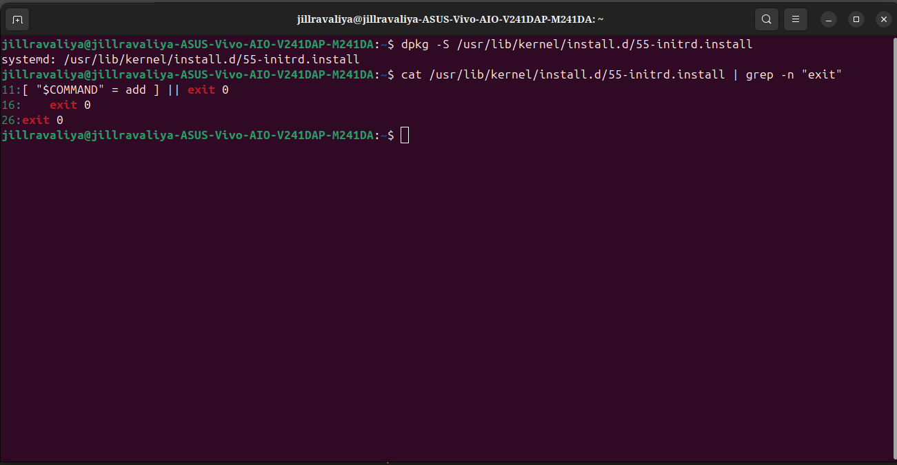

# From Purple Screen to systemd Bug Discovery


> *"Most people reinstalled. I asked 'why' eight times. That's how you find the real bug—and discover 110+ users were suffering from the same silent systemd failure."*

---

## The Setup: Building a Kernel Driver (The Safe Way)

> **January 9, 2026**

I completed the Linux Foundation's **"A Beginner's Guide to Linux Kernel Development"** (LFD103) course. But I didn't stop at the certificate. I wanted to build something real—a kernel driver that actually runs in Ring 0, manages memory, and handles the boundary between user space and kernel space.

So I built a circular queue driver:
- Character device at `/dev/jill`
- Blocking I/O with wait queues
- IOCTL commands for Ring 3 ↔ Ring 0 communication
- Real kernel code running in privileged space

**The Problem:** Kernel development is dangerous. One wrong pointer in Ring 0 = instant crash. No debugger. No recovery. Just a frozen system.

**My Solution:** Install VirtualBox → Create Ubuntu VM → Run ALL experiments inside the VM

> "If the kernel crashes, only the VM dies. My host stays safe."

I spent weeks testing inside that VM. I loaded my kernel module, tested it with user programs, crashed it a few times (whoops—forgot to validate a pointer), fixed the bugs, learned how blocking I/O actually works at the kernel level. I watched wait queues in action, debugged race conditions, and understood synchronization primitives not from a textbook but from real crashes.

**My host system? Never touched it during any of these experiments. Stayed perfectly safe.**

---

## When the Purple Screen Appeared

> **February 13, 2026 - Morning**

I woke up. Made coffee. Sat down at my desk. Powered on my laptop.

Instead of the login screen, I got a purple screen with white text:

```
KERNEL PANIC!
Please reboot your computer.
VFS: Unable to mount root fs on unknown-block(0,0)
```


**The purple screen of death: VFS unable to mount root fs on unknown-block(0,0)**

For a moment I just stared at it. **A kernel panic. On my HOST machine. The machine I never experimented on.**

> Wait—I installed VirtualBox specifically to AVOID this. Everything was in the VM. How did the HOST panic?

Then it hit me: this wasn't caused by my code. I didn't load any modules on the host. This was something else entirely.

---

## Emergency Recovery: The GRUB Lifeline

I turned off the machine. Powered it back on.

This time, instead of letting it boot automatically, I pressed a key to interrupt the process. A menu appeared—this is **GRUB, the bootloader**. It's the program that runs after your BIOS/UEFI but before Linux starts. GRUB's job is to load the kernel into memory and start it running. When something goes wrong with the kernel, GRUB gives you this menu so you can choose different boot options.

**Available kernels:**
- Ubuntu, with Linux **6.17.0-14-generic** ← This one just panicked
- Ubuntu, with Linux **6.14.0-37-generic** ← My previous kernel


**GRUB bootloader showing the choice between broken kernel 6.17.0-14 and working kernel 6.14.0-37**

I selected the old kernel—6.14. The system booted perfectly. Desktop appeared. Everything worked normally.

So the problem was specific to kernel 6.17. And here's what made this concerning: **GRUB always picks the newest kernel version by default.** It sorts versions numerically, and since `6.17 > 6.14`, every automatic boot would go straight to the broken kernel. Every reboot. Every power cut. Every automatic restart after an update. **Instant purple screen, every single time.**

> If I wanted to use my computer, I'd have to manually select the old kernel from GRUB every single time I booted. That's not sustainable.

I needed to understand what broke and fix it properly.

---

## The Missing initrd File

Once logged into the working kernel, I checked which one was actually running:

```bash
$ uname -r
6.14.0-37-generic
```

Good. I'm on the working kernel. Now let me look at what's in `/boot`—the directory where all kernel-related files live:

```bash
$ ls -la /boot/initrd*
```

Output:

```
lrwxrwxrwx  1 root root    28 Feb 13 08:41  initrd.img -> initrd.img-6.17.0-14-generic
-rw-r--r--  1 root root 73101720 Jan 16 08:57  initrd.img-6.14.0-37-generic
lrwxrwxrwx  1 root root    28 Feb 11 09:09  initrd.img.old -> initrd.img-6.14.0-37-generic
```

**Something was wrong.** I could see a symlink (a pointer to another file) called `initrd.img` that points to `initrd.img-6.17.0-14-generic`. But when I looked at the actual files in `/boot`, I only saw `initrd.img-6.14.0-37-generic`. There was no `initrd.img-6.17.0-14-generic` file.


**The smoking gun: the initrd.img symlink points to a file that was never created**

> The symlink was pointing to a file that didn't exist. It's like having a road sign that says "Bridge ahead, 1 mile" but when you drive there, the bridge was never built.

When Linux boots, the kernel needs drivers to access your storage. But those drivers are stored ON the storage itself—a chicken-and-egg problem. **How do you read the disk without the driver that lets you read the disk?** That's what the **initrd** (initial RAM disk) solves. It's a small, temporary filesystem that GRUB loads into RAM alongside the kernel, containing just enough drivers—like the NVMe driver for my SSD—to get the kernel to the point where it can mount the real disk. Think of it as a survival kit: the kernel boots, mounts this temporary filesystem, loads the storage driver from it, and THEN can access the actual disk to continue booting.

Without initrd, the kernel boots blind. It knows it's supposed to find a root filesystem somewhere, but it has no way to access the storage device.

> That's exactly what the error message meant: `VFS: Unable to mount root fs on unknown-block(0,0)`. The `unknown-block(0,0)` means block device with major number 0 and minor number 0—which in Linux literally means "no device at all." It's the kernel's way of saying "I looked for a disk and found absolutely nothing."

Because without the NVMe driver, the kernel genuinely cannot see the NVMe SSD. To the kernel, it doesn't exist.

### The Quick Fix

Now that I understood the problem, fixing it was straightforward. I needed to generate the missing initrd file for kernel 6.17.

```bash
$ sudo update-initramfs -c -k 6.17.0-14-generic
```

The `-c` flag means "create" and `-k` specifies which kernel version. This command packs hundreds of kernel modules into a single compressed file. It took about 30 seconds.

Let me verify it was created:

```bash
$ ls -la /boot/initrd.img-6.17.0-14-generic
-rw-r--r--  1 root root 73711966 Feb 13 11:58  initrd.img-6.17.0-14-generic
```

Perfect! A **73MB file, created at 11:58 AM.** The bridge now exists.

But GRUB still needs to know about it. Let me update GRUB's configuration:

```bash
$ sudo update-grub
```

Output:

```
Generating grub configuration file ...
Found linux image: /boot/vmlinuz-6.17.0-14-generic
Found initrd image: /boot/initrd.img-6.17.0-14-generic
Found linux image: /boot/vmlinuz-6.14.0-37-generic
Found initrd image: /boot/initrd.img-6.14.0-37-generic
done
```

Good. GRUB now sees both the kernel and its initrd. Time to test:

```bash
$ sudo reboot
```

The system rebooted. This time, I let GRUB pick automatically. It loaded kernel 6.17. The boot process continued smoothly. Desktop appeared.

```bash
$ uname -r
6.17.0-14-generic
```

**Problem solved.** The system was working again.

Most people would stop here. Problem identified, problem fixed, back to work. But I couldn't stop thinking about one question:

**How did the initrd go missing in the first place?**

---

## The Three-Day Pattern

This wasn't normal. When Ubuntu installs a new kernel, it's **supposed** to automatically generate the initrd. That's part of the standard installation process. Something went wrong during the kernel installation. But what? And when?

Linux keeps detailed logs of every package operation. Let me check the dpkg log to see exactly when kernel 6.17 was installed:

```bash
$ sudo cat /var/log/dpkg.log | grep "6.17.0-14" | grep "trigproc\|half-configured"
```

Output:

```
2026-02-11 09:09:32  trigproc linux-image-6.17.0-14-generic:amd64 6.17.0-14.14-24.04.1 <none>
2026-02-11 09:09:32  status half-configured linux-image-6.17.0-14-generic:amd64 6.17.0-14.14-24.04.1

2026-02-12 09:36:03  trigproc linux-image-6.17.0-14-generic:amd64 6.17.0-14.14-24.04.1 <none>
2026-02-12 09:36:03  status half-configured linux-image-6.17.0-14-generic:amd64 6.17.0-14.14-24.04.1

2026-02-13 08:41:13  trigproc linux-image-6.17.0-14-generic:amd64 6.17.0-14.14-24.04.1 <none>
2026-02-13 08:41:13  status half-configured linux-image-6.17.0-14-generic:amd64 6.17.0-14.14-24.04.1
```

This was fascinating and concerning. **Three days in a row. Same exact failure point. Every single time.**

- **February 11, 9:09 AM** - First attempt
- **February 12, 9:36 AM** - Second attempt
- **February 13, 8:41 AM** - Third attempt (less than 3 hours before I rebooted and saw the panic)


**The dpkg log reveals a consistent pattern: three consecutive days, same failure state**

All three attempts reached the same stage: `trigproc` → `half-configured` → stopped.

When Ubuntu installs a package, it goes through several stages. The package should move smoothly from **unpacked** (files copied to disk) → **half-configured** (setup started) → **installed** (fully configured and ready). But in all three attempts, the kernel package got stuck at `half-configured`. Something was failing during the configuration step.

That `trigproc` line stands for **"trigger processing"**—post-installation tasks that run automatically after the main package files are in place. For a kernel, these triggers handle things like generating the initramfs (the initrd file we saw missing), updating GRUB's boot menu configuration, compiling any third-party kernel modules via a system called DKMS, and running hardware-specific hooks. They run silently in the background during normal `apt upgrade` operations.

But in this case, something in the trigger processing was failing. **Three days in a row.** The question was: which script was failing, and why?

---

## The DKMS Failure

I needed more detailed logs. The dpkg log only shows status changes—not the actual errors that caused those status changes. For the detailed error messages and command output, I needed to check the apt terminal log, which captures everything that happens during package installations:

```bash
$ sudo cat /var/log/apt/term.log | grep -C 10 "exit status 11"
```

The `-C 10` means "show 10 lines of context before and after the match."

Output:

```
Setting up linux-image-6.17.0-14-generic (6.17.0-14.14-24.04.1) ...
I: /boot/vmlinuz.old is now a symlink to vmlinuz-6.14.0-37-generic
I: /boot/initrd.img.old is now a symlink to initrd.img-6.14.0-37-generic
I: /boot/vmlinuz is now a symlink to vmlinuz-6.17.0-14-generic
I: /boot/initrd.img is now a symlink to initrd.img-6.17.0-14-generic
dkms: running auto installation service for kernel 6.17.0-14-generic
...fail!
run-parts: /etc/kernel/postinst.d/dkms exited with return code 11

dpkg: error processing package linux-image-6.17.0-14-generic (--configure):
 installed linux-image-6.17.0-14-generic package post-installation script 
 subprocess returned error exit status 11
```


**DKMS failure log showing exit code 11 that blocked kernel installation**

**There it was. DKMS failed with exit code 11.** And when DKMS failed, the entire kernel installation was aborted. The package never reached the "installed" state.

Now let me explain what DKMS is and why its failure blocked everything else. **DKMS—Dynamic Kernel Module Support—is a system that manages third-party kernel modules**, pieces of code that aren't part of the official Linux kernel but need to integrate with it. Things like VirtualBox drivers, NVIDIA graphics drivers, ZFS filesystem modules, VPN kernel modules, and some WiFi drivers all use DKMS. Here's the problem it solves: **kernel modules are version-specific**. A module compiled for kernel 6.14 won't work on 6.17 because the kernel's internal APIs can change between versions. Without DKMS, you'd have to manually recompile all your third-party modules every time you installed a new kernel—tedious and error-prone. DKMS automates this. When you install a new kernel, DKMS automatically detects all registered third-party modules and recompiles each one for the new kernel version. This happens automatically during kernel installation as part of the post-install scripts.

But in my case, DKMS tried to compile something and failed with **exit code 11**—an exit code is how programs communicate success or failure to the system. Exit code 0 means success. Any non-zero code means failure. Exit code 11 typically indicates a compilation or linking error.

**The question was: what was DKMS trying to compile, and why did it fail?**

---

## The Broken VirtualBox Package

I needed to find the actual compilation error. Let me search the logs more carefully:

```bash
$ sudo cat /var/log/apt/term.log | grep -B 5 -A 10 "VBox"
```

Output:

```
Building module:
cleaning build area...
make -j2 KERNELRELEASE=6.17.0-14-generic -C /lib/modules/6.17.0-14-generic/build 
  M=/var/lib/dkms/virtualbox/7.0.16/build
...(bad exit status: 2)

Error! Bad return status for module build on kernel: 6.17.0-14-generic (x86_64)
Consult /var/lib/dkms/virtualbox/7.0.16/build/make.log for more information.

In file included from /var/lib/dkms/virtualbox/7.0.16/build/vboxdrv/linux/SUPDrv-linux.c:42:
/var/lib/dkms/virtualbox/7.0.16/build/vboxdrv/include/SUPDrvInternal.h:47:10: 
  fatal error: VBox/cdefs.h: No such file or directory
   47 | #include <VBox/cdefs.h>
      |          ^~~~~~~~~~~~~~
compilation terminated.
```


**VirtualBox DKMS compilation failure: missing VBox/cdefs.h header file**

**VirtualBox.** The very VirtualBox I installed to safely build my kernel driver was the thing that broke the host kernel installation.

The error is crystal clear: the VirtualBox DKMS module tried to compile for kernel 6.17, but it's missing a header file called `VBox/cdefs.h`. A header file contains declarations and definitions that code needs to compile—without it, the compiler can't understand what certain functions and types mean, so compilation fails.

Let me check which version of VirtualBox is installed:

```bash
$ apt-cache policy virtualbox
```

Output:

```
virtualbox:
  Installed: 7.0.16-dfsg-2ubuntu1.1
  Candidate: 7.0.16-dfsg-2ubuntu1.1
```

Notice that **dfsg** in the version string. This is significant. **DFSG stands for "Debian Free Software Guidelines."** Ubuntu is committed to free and open-source software. When they package VirtualBox—which has some proprietary components—they strip out those proprietary pieces to maintain their open-source principles. The modified version is called a "dfsg" package. The problem? One of those removed components contained critical header files, including `VBox/cdefs.h`. So Ubuntu shipped a **fundamentally broken package**: a DKMS module that registers itself to compile for every new kernel but actually cannot compile because it's missing its own header files.

> This package was a ticking time bomb from the moment it was installed. It was always going to fail on the next kernel upgrade.

And here's the beautiful, terrible irony: **I installed VirtualBox to create a safe sandbox for kernel experiments. VirtualBox never caused a single problem inside the VM. But VirtualBox's mere existence on the host—registered with DKMS—became a silent threat waiting for the next kernel upgrade.**

When kernel 6.17 tried to install, DKMS attempted to compile VirtualBox, failed, and aborted the entire kernel installation. The initrd was never generated.

But the question remained: **why did DKMS failing prevent initrd generation?**

---

## The Alphabetical Execution Trap

To understand what happened next, I need to show you how post-install scripts work in Ubuntu.

When a kernel package is installed, it needs to run several setup scripts. These scripts live in a specific directory:

```bash
$ ls /etc/kernel/postinst.d/
```

Output:

```
dkms
initramfs-tools
unattended-upgrades
update-notifier
xx-update-initrd-links
zz-shim
zz-update-grub
```


**The /etc/kernel/postinst.d/ directory showing alphabetical script ordering**

These scripts are executed by a program called `run-parts`, which has one simple rule: **execute scripts in alphabetical order, and if any script returns an error (non-zero exit code), stop immediately.**

Look at the alphabetical ordering:

1. `dkms` - starts with 'd'
2. `initramfs-tools` - starts with 'i'
3. `unattended-upgrades` - starts with 'u'
4. `update-notifier` - starts with 'u'
5. `xx-update-initrd-links` - starts with 'x'
6. `zz-shim` - starts with 'z'
7. `zz-update-grub` - starts with 'z'

The naming is deliberate. Notice how `zz-update-grub` starts with 'zz'? That ensures it runs last, after all other scripts have finished. Scripts that need to run early get names that start with letters near the beginning of the alphabet.

But here's the critical problem: **`dkms` runs BEFORE `initramfs-tools`.** The `dkms` script runs first because 'd' comes before 'i' alphabetically. The `initramfs-tools` script—the one that generates the initrd—runs second. When DKMS failed and returned exit code 11, `run-parts` saw the non-zero exit code and **immediately stopped execution**. All subsequent scripts—including the critical `initramfs-tools` script—never ran.

> That's why the initrd was never generated. One broken VirtualBox header file blocked the entire critical boot preparation sequence.

You might wonder: why have this "stop on first error" behavior? Why not let each script try independently? The reasoning is that later scripts often depend on earlier scripts succeeding. For example, `zz-update-grub` needs the initramfs to exist before it can update GRUB's configuration. If an early script fails, continuing might leave the system in a partially configured, broken state where some things are set up but others aren't, creating subtle bugs that are hard to debug. The design makes sense in theory—but in practice, it means one unrelated failure (VirtualBox DKMS) can cascade into a critical failure (no initramfs, unbootable system).

---

## Why NVMe Systems Die Without initramfs

At this point, I had the chain of events: VirtualBox DKMS failed → post-install scripts stopped early → initramfs was never generated → system panicked on boot. But why does a missing initramfs cause a panic specifically on NVMe systems? Why not on older SATA systems?

The answer is in how Ubuntu configured the kernel. Let me check:

```bash
$ cat /boot/config-6.17.0-14-generic | grep "NVME\|INITRAMFS"
```

Output:

```
CONFIG_BLK_DEV_INITRD=y
CONFIG_INITRAMFS_SOURCE=""
CONFIG_BLK_DEV_NVME=m
```


**Kernel configuration showing NVMe as module (=m) and no embedded initramfs**

Let me explain what each of these configuration flags means. **CONFIG_BLK_DEV_INITRD=y** means the kernel CAN use an initrd if one is provided—the `=y` doesn't mean it HAS one built in, just that it has the capability to load one. Think of it like a car having a trailer hitch—the hitch is there, but you still need to attach a trailer. **CONFIG_INITRAMFS_SOURCE=""** is critical. The empty string means the kernel has **NO embedded initramfs**. Some embedded systems compile a minimal initramfs directly into the kernel binary as a fallback. Ubuntu doesn't do this—they keep the kernel small and rely entirely on an external initrd file provided by GRUB. **CONFIG_BLK_DEV_NVME=m** is the key line. The `=m` means the NVMe driver is compiled as a **MODULE**, not built into the kernel. In kernel configuration, `=y` means "compile this directly into the kernel binary" while `=m` means "compile this as a separate loadable module."

Compare this to SATA support:

```bash
$ cat /boot/config-6.17.0-14-generic | grep "CONFIG_ATA="
CONFIG_ATA=y
```

The `=y` means SATA support is built directly into the kernel binary. So on an older system with SATA drives, the kernel wakes up with SATA support already present. It can see the disk immediately, even without initramfs. But on an NVMe system? The NVMe driver exists only as a separate file: `nvme-core.ko.zst` (a compressed kernel module). That file lives inside the initramfs. Without initramfs, that module never loads. The kernel boots but has no way to access NVMe storage.

Why design it this way? Practical reasons: **smaller kernel binary** (each driver can be hundreds of KB, keeping them as modules makes the kernel much smaller and faster to load), **flexibility** (modules can be updated without recompiling the entire kernel—if there's a bug fix or improvement to the NVMe driver, it can be updated independently), and **modularity** (not every system has NVMe, so why make every kernel carry NVMe code if it might never be used?). Desktop systems, servers, VMs, and embedded devices all run the same kernel but have wildly different hardware.

But this design has one critical requirement: **initramfs must exist and must be loaded.** When that requirement isn't met, NVMe systems become unbootable.

I wanted to confirm that the NVMe driver really does live inside initramfs. Let me inspect the initramfs file:

```bash
$ lsinitramfs /boot/initrd.img-6.17.0-14-generic | grep -i "nvme"
```

The `lsinitramfs` command lists the contents of an initramfs file without extracting it.

Output:

```
usr/lib/modules/6.17.0-14-generic/kernel/drivers/nvme
usr/lib/modules/6.17.0-14-generic/kernel/drivers/nvme/common
usr/lib/modules/6.17.0-14-generic/kernel/drivers/nvme/common/nvme-auth.ko.zst
usr/lib/modules/6.17.0-14-generic/kernel/drivers/nvme/common/nvme-keyring.ko.zst
usr/lib/modules/6.17.0-14-generic/kernel/drivers/nvme/host
usr/lib/modules/6.17.0-14-generic/kernel/drivers/nvme/host/nvme-core.ko.zst
usr/lib/modules/6.17.0-14-generic/kernel/drivers/nvme/host/nvme-fabrics.ko.zst
usr/lib/modules/6.17.0-14-generic/kernel/drivers/nvme/host/nvme-fc.ko.zst
usr/lib/modules/6.17.0-14-generic/kernel/drivers/nvme/host/nvme.ko.zst
```


**Listing of initramfs contents showing NVMe driver modules exist only inside this file**

There they are. The `.ko.zst` files are compressed kernel modules. `nvme-core.ko.zst` is the main NVMe driver module. Without this loading during boot, the kernel cannot access NVMe storage. And these modules exist **only** inside the initramfs file. They're not on the disk. They're in this compressed archive that GRUB loads into RAM.

Let me check the boot log from the working kernel to see exactly what happens:

```bash
$ journalctl -b -1 | grep -i "initramfs\|nvme" | head -20
```

Output:

```
Feb 13 11:58:45 kernel: Trying to unpack rootfs image as initramfs...
Feb 13 11:58:45 kernel: Freeing initrd memory: 73728K
Feb 13 11:58:45 kernel: nvme nvme0: pci function 0000:02:00.0
Feb 13 11:58:45 kernel: nvme 0000:02:00.0: enabling device (0000 -> 0002)
Feb 13 11:58:45 kernel: nvme nvme0: 8/0/0 default/read/poll queues
Feb 13 11:58:45 kernel: nvme nvme0: Ignoring bogus Namespace Identifiers
Feb 13 11:58:46 kernel:  nvme0n1: p1 p2 p3
Feb 13 11:58:46 kernel: EXT4-fs (nvme0n1p1): mounted filesystem with ordered data mode. Quota mode: none.
```

The sequence is clear:

1. Kernel unpacks initramfs into RAM
2. Kernel frees the memory used by initramfs after extracting it
3. NVMe driver loads from the extracted modules
4. NVMe device `nvme0` is detected on the PCI bus
5. Partitions are detected (`nvme0n1p1`, `nvme0n1p2`, `nvme0n1p3`)
6. Filesystem mounts successfully from the first partition

> Remove step 1, and steps 2-6 never happen. The NVMe device never appears. The kernel sees nothing.

---

## The systemd Silent Failure Bug

At this point, I understood the complete chain:

1. VirtualBox DKMS fails
2. Post-install scripts stop
3. initramfs never generated
4. NVMe driver never loads
5. Kernel panic

But I was still bothered by one question: **why did GRUB create a boot entry for kernel 6.17 when the initrd was missing? Why didn't the system warn me?**

If the initrd is so critical that its absence causes instant kernel panic, shouldn't the system refuse to complete the installation without it? Shouldn't there be a loud, visible error preventing me from rebooting into a broken kernel?

I started tracing through the kernel installation process more carefully. There are actually multiple layers of scripts involved. I'd already looked at `/etc/kernel/postinst.d/`, but there's another directory: `/usr/lib/kernel/install.d/`. Let me check that:

```bash
$ ls /usr/lib/kernel/install.d/
```

Output:

```
50-depmod.install
55-initrd.install
90-loaderentry.install
90-update-grub.install
```

That `55-initrd.install` caught my attention. This script specifically handles initrd installation. Let me look at it:

```bash
$ cat /usr/lib/kernel/install.d/55-initrd.install
```

Here's the critical section:

```bash
#!/bin/sh
set -eu

COMMAND="$1"
KERNEL_VERSION="$2"
BOOT_DIR_ABS="$3"
KERNEL_IMAGE="$4"
INITRD_SRC="/boot/initrd.img-$KERNEL_VERSION"

[ "$COMMAND" = add ] || exit 0

if [ "$#" -ge 5 ]; then
    INITRD_DEST="$5"
else
    INITRD_DEST="$BOOT_DIR_ABS/linux-$KERNEL_VERSION.img"
fi

if [ -e "$INITRD_SRC" ]; then
    [ "$KERNEL_INSTALL_VERBOSE" -gt 0 ] && \
      echo "Installing $KERNEL_VERSION initrd from $INITRD_SRC to $INITRD_DEST"
    install -m 0644 "$INITRD_SRC" "$INITRD_DEST"
else
    [ "$KERNEL_INSTALL_VERBOSE" -gt 0 ] && \
      echo "$INITRD_SRC does not exist, not installing an initrd"
fi

exit 0
```


**The systemd 55-initrd.install script showing the exit 0 bug on line 26**

**Look at that last line.**

The script checks if the initrd file exists using the `[ -e "$INITRD_SRC" ]` test. If it does exist, it installs it to the appropriate location. If it doesn't exist, it prints a message (that nobody sees during a normal apt upgrade because `KERNEL_INSTALL_VERBOSE` is 0 by default) and then...

> **It exits with code 0. Exit code 0 means SUCCESS.**

The script is telling the system "everything is fine!" even though a critical boot file is missing.



**Multiple instances in systemd scripts where exit 0 allows silent failures**

When this script returns success (exit 0), it tells the rest of the kernel installation process: kernel installation is complete, all necessary files are in place, safe to create a GRUB boot entry. GRUB receives this "all good!" signal and confidently writes a boot entry for kernel 6.17, pointing to an initrd file that doesn't exist. When you reboot and GRUB loads that boot entry, it tries to load the missing initrd, fails silently, and boots the kernel without it. **Instant panic on NVMe systems.**

The correct behavior would be to return **exit code 1 (FAILURE)** when the initrd is missing. That would: stop the kernel installation process immediately, cause dpkg to report a visible error to the terminal, prevent GRUB from creating an unbootable boot entry, alert the user to fix the problem BEFORE rebooting, and show up in system logs as a clear failure. Instead, by returning exit 0, the error is swallowed. The problem becomes invisible. The system acts as if everything succeeded. The user has no idea anything went wrong until they reboot and see a kernel panic.

Let me find out which package owns this file:

```bash
$ dpkg -S /usr/lib/kernel/install.d/55-initrd.install
systemd: /usr/lib/kernel/install.d/55-initrd.install
```

This script is part of the **systemd** package, version 255.4-1ubuntu8.12, maintained by Ubuntu Developers and Debian systemd Maintainers. This is a bug in systemd's kernel-install infrastructure, carried by both Debian and Ubuntu. The fix would be trivial—literally changing **one line** from `exit 0` to `exit 1` when the initrd is missing. But because nobody had caught this before, the bug has been silently allowing unbootable kernel installations on NVMe systems whenever any DKMS module fails.

---

## Root Cause vs Trigger: A Critical Distinction

Now I could answer the question: "What caused the kernel panic?"

But there's a crucial distinction to make here, and it's important for understanding how complex systems fail.

**VirtualBox is NOT the root cause.**  
**VirtualBox is the TRIGGER that exposed a deeper bug.**

Let me explain the difference, because this distinction matters when you're debugging production systems or explaining failures in technical interviews. **The Trigger:** VirtualBox's DKMS module failed to compile because Ubuntu ships a broken dfsg package that's missing essential header files. That failure blocked initramfs generation by stopping the post-install script chain. **The Root Cause:** systemd's `55-initrd.install` script returning **exit 0 (success)** when initrd is missing. This allows GRUB to create unbootable boot entries with zero warning to the user.

If someone asks "What caused your kernel panic?" and I answer "VirtualBox," that's surface-level thinking. It's technically true that removing VirtualBox fixed the immediate problem. But it misses the deeper architectural issue. **The truth is: ANY DKMS module failure would trigger this same panic on NVMe systems.** It could have been nvidia-dkms failing to compile, zfs-dkms having compilation issues, virtualbox-dkms (which happened in my case), wireguard-dkms encountering problems, or some custom third-party driver failing. Any of these failures would block initramfs generation through the same mechanism: DKMS fails → run-parts stops → initramfs-tools never runs → initrd never created. And systemd's silent exit 0 would allow GRUB to create an unbootable boot entry in every case.

> The real fault is the design bug that allows the system to silently proceed when a critical component is missing. That's what makes this a systemd bug, not a VirtualBox bug.

**For technical discussions, this distinction becomes important:**

**❌ Surface-level answer:** "VirtualBox caused my kernel panic, so I removed it and the problem went away."

**✅ Systems thinking answer:** "The root cause is systemd's 55-initrd.install returning exit 0 when initrd is missing. This creates a silent failure mode where GRUB generates unbootable boot entries with zero user warning. VirtualBox's DKMS compilation failure was the trigger in my specific case, but any DKMS failure would expose this bug on NVMe systems. The fix isn't just removing VirtualBox—it's patching systemd to fail loudly when critical boot files are missing, so users get visible errors before rebooting into an unbootable system."

---

## Filing the Bug Report

Once I understood the complete picture, I knew I needed to report this properly.

I searched Ubuntu's Launchpad bug tracker first. The VirtualBox DKMS failure was already well-known:

**Bug #2136499** - virtualbox-dkms fails to build for kernel 6.17
- **110+ affected users**
- **618 comments**
- Status: Confirmed
- Assigned to: Nobody

But as I read through those **618 comments**, I noticed something important. Everyone was focused on VirtualBox. People were discussing the missing headers, debating whether Ubuntu should ship dfsg packages at all, suggesting workarounds for compiling VirtualBox manually. But nobody had traced the problem deeper. Nobody had identified why this resulted in unbootable systems instead of just visible installation errors. **Nobody had found the systemd bug.**

So I filed a new bug against the systemd package:

**Bug #2141741:** *55-initrd.install silently exits 0 when initrd missing causing undetectable kernel panic on NVMe systems*

My report included a complete summary of what happens (when initramfs generation fails due to DKMS errors, systemd's script detects the missing initrd but returns exit 0), why it's critical (allows unbootable boot entries with zero warning), which systems are affected (any NVMe system where any DKMS module fails), and the proposed fix (change line 26 from `exit 0` to `exit 1`). I attached full error logs from all three installation attempts, the exact script content showing the bug, proof from my system showing the missing initrd, the complete failure chain from VirtualBox to kernel panic, and an impact assessment.

I hit submit. The bug appeared on Launchpad with a fresh ID: **Bug #2141741**.


**Bug #2141741 filed on February 13, 2026 with initial status "New"—the investigation begins**

Then I went back to Bug #2136499 (the VirtualBox bug) and posted Comment #9, linking to my systemd report and explaining how the VirtualBox DKMS failures were just the trigger—the real problem was systemd's silent exit 0 allowing unbootable boot entries. This connected the **110+ affected VirtualBox users** to the deeper systemd issue.

I didn't expect a fast response. Ubuntu developers are busy. Bug trackers move slowly.

But **two hours later**, I refreshed the page. The status had changed.

**Result:** Within 2 hours, Ubuntu developers confirmed Bug #2141741. The status changed from "New" to **"Confirmed"** ✅


**Less than 24 hours later: Bug confirmed by Ubuntu developers, now affecting 5 users—validating the root cause analysis**

The confirmation meant Ubuntu's developers agreed: this wasn't just a VirtualBox problem. It was a systemd infrastructure bug that could affect anyone with DKMS module failures on NVMe systems.

---

## System Restored

The immediate fix for my system was straightforward:

```bash
# Remove VirtualBox
$ sudo apt remove --purge virtualbox
$ sudo dkms remove virtualbox/7.0.16 --all

# Verify clean
$ dkms status
[empty]

# Both kernels now have initrd
$ ls -la /boot/initrd*
-rw-r--r--  73101720  initrd.img-6.14.0-37-generic
-rw-r--r--  73711966  initrd.img-6.17.0-14-generic

# Running latest kernel
$ uname -r
6.17.0-14-generic
```

**System healthy. Both kernels bootable.**

---

## The Complete Failure Chain

```
Ubuntu ships virtualbox-7.0.16-dfsg (missing VBox/cdefs.h)
    ↓
Feb 11, 09:09 AM - apt upgrade installs kernel 6.17
    ↓
DKMS attempts VirtualBox compilation → fails (missing header)
    ↓
DKMS returns exit code 11
    ↓
run-parts executes postinst.d/ alphabetically
    ↓
'dkms' runs before 'initramfs-tools' → sees error → STOPS
    ↓
initramfs-tools NEVER runs
    ↓
initrd.img-6.17.0-14-generic NEVER created
    ↓
55-initrd.install detects missing initrd
    ↓
Prints quiet warning → Returns exit 0 (SUCCESS) ← THE BUG
    ↓
GRUB receives "all good" → Creates boot entry for 6.17
    ↓
Feb 13, Morning - I reboot
    ↓
GRUB loads kernel 6.17 → tries to load initrd → doesn't exist
    ↓
Kernel boots WITHOUT initrd
    ↓
NVMe driver (CONFIG_BLK_DEV_NVME=m) only exists in initramfs
    ↓
Module never loads → Kernel cannot see NVMe SSD
    ↓
unknown-block(0,0)
    ↓
KERNEL PANIC 💀
```

---

## What I Learned

### Silent Failures Are the Most Dangerous

When `55-initrd.install` returned exit 0 despite missing initrd, it broke the error propagation chain:

**What happened:**
```
initrd missing → quiet warning → exit 0 → 
GRUB creates entry → user reboots → PANIC
```

**What should happen:**
```
initrd missing → exit 1 → dpkg fails → 
apt shows error → user fixes BEFORE reboot
```

> **Silent success broke error propagation.** Failure became invisible until catastrophic.

### Investigation Depth Matters

Most people stop at layer 2 or 3. I went to layer 8:

1. Missing initrd file
2. Three-day installation failure
3. DKMS exit 11
4. VirtualBox compilation error
5. Alphabetical script ordering
6. NVMe module design
7. Boot log evidence
8. systemd silent exit 0 ← **The actual bug**

> Each layer revealed why the previous failed. That's systematic root cause analysis—not just "what broke" but "why was it allowed to break that way."

---

## Connect With Me

I'm actively learning and building in the **systems programming** and **kernel development** space.

- **Email:** jillahir9999@gmail.com
- **LinkedIn:** [linkedin.com/in/jill-ravaliya-684a98264](https://linkedin.com/in/jill-ravaliya-684a98264)
- **GitHub:** [github.com/jillravaliya](https://github.com/jillravaliya)

**Open to:**

- Kernel development mentorship
- Systems programming collaboration
- Technical discussions on kernel internals
- Open source contribution guidance

### ⭐ Star this repository if you find it helpful for your kernel development journey!

---

> **For detailed explanations, navigate to individual topic folders. Each contains a comprehensive README covering its area.**

<div align="center">

</div>
