# Kernel Panic Investigation: When the Safety Net Became the Trap


---

> *"I installed VirtualBox to protect my kernel experiments. Then VirtualBox triggered a kernel panic on my HOST system. The universe has a sense of humor."*

I could have fixed it in **10 minutes** and moved on. Instead, I spent the entire day going **8 layers deep**—from a purple panic screen to a systemd source code bug that nobody else had found—and filed an original Ubuntu bug report that got **confirmed by developers within 2 hours**.

**This is that investigation.**

---

## The Setup: Building a Kernel Driver (The Safe Way)

**January 9, 2026**

I completed the Linux Foundation's **"A Beginner's Guide to Linux Kernel Development"** (LFD103) course. But I didn't stop at the certificate. I wanted to build something real—a kernel driver that actually runs in Ring 0, manages memory, and handles the boundary between user space and kernel space.

So I built a circular queue driver:
- Character device at `/dev/jill`
- Blocking I/O with wait queues
- IOCTL commands for Ring 3 ↔ Ring 0 communication
- Real kernel code running in privileged space

**The Problem:** Kernel development is dangerous. One wrong pointer in Ring 0 = instant crash. No debugger. No recovery. Just a frozen system requiring a hard reboot. If user space crashes, the kernel can clean it up. But if the kernel crashes? Everything dies.

**My Solution:** Install VirtualBox → Create Ubuntu VM → Run ALL experiments inside the VM

> **The Logic:** If the kernel crashes, only the VM dies. My host stays safe.

I spent weeks testing inside that VM:
- Loaded modules ✓
- Crashed a few times (whoops—forgot to validate a pointer) ✓
- Fixed bugs ✓
- Learned how blocking I/O really works ✓

My host system? Never touched it. Stayed perfectly safe.

**Or so I thought.**

---

## When the Purple Screen Appeared

**February 13, 2026 - Morning**

I woke up. Made coffee. Sat down at my desk. Powered on my laptop.

Instead of the login screen:

```
KERNEL PANIC!
Please reboot your computer.
VFS: Unable to mount root fs on unknown-block(0,0)
```

**A kernel panic. On my HOST machine. The machine I never experimented on.**

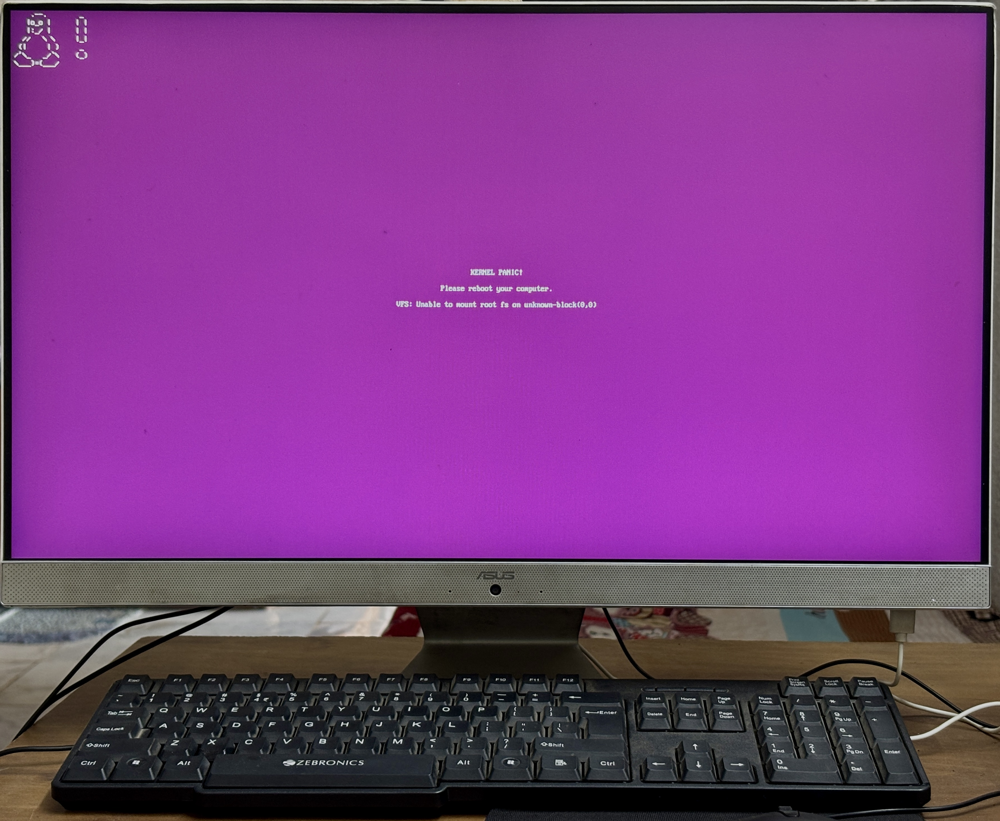

**The purple screen of death: VFS unable to mount root fs on unknown-block(0,0)**

I just stared at it for a moment. How? I installed VirtualBox specifically to avoid this. Everything was in the VM.

Then it hit me: **this wasn't caused by my code.** This was something else entirely.

---

## Emergency Recovery: The GRUB Lifeline

I turned off the machine. Powered it back on.

This time I interrupted the boot process. A menu appeared—GRUB, the bootloader that sits between your BIOS/UEFI firmware and Linux. GRUB's job is to load the kernel binary (vmlinuz) into RAM and start it executing. Think of it as the program that wakes up first and then wakes up Linux. When things go wrong with one kernel, GRUB becomes your safety net, giving you a menu to choose different boot options or older kernel versions.

**Available kernels:**
- Ubuntu, with Linux **6.17.0-14-generic** ← Just panicked
- Ubuntu, with Linux **6.14.0-37-generic** ← Previous kernel

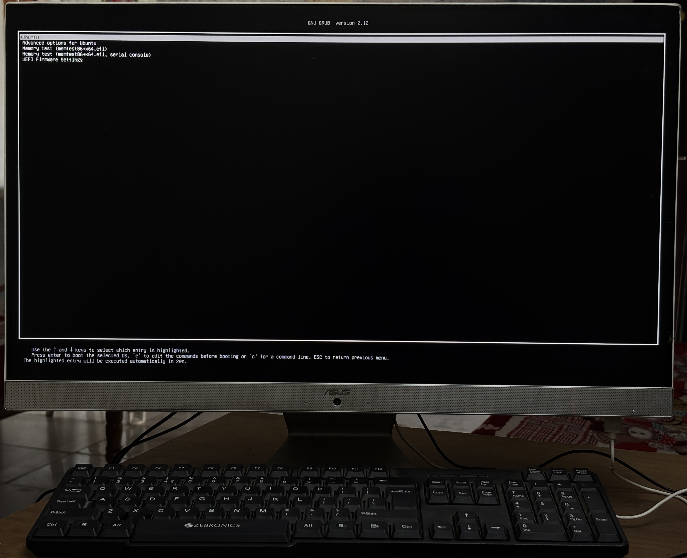

**GRUB bootloader showing the choice between broken kernel 6.17.0-14 and working kernel 6.14.0-37**

I selected 6.14. The system booted perfectly.

So kernel 6.17 was broken. And here's the concerning part: GRUB always picks the newest kernel by default. It sorts versions numerically—since 6.17 > 6.14, every automatic boot would load the broken kernel. Every reboot. Every power cut. Every automatic restart after an update. Instant purple screen.

> **The Problem:** If I wanted to use my computer normally, I'd have to manually select the old kernel from GRUB every single time I booted. That's not sustainable.

I needed to understand what broke and fix it.

---

## Layer 1: The Missing Piece

Once logged into the working kernel:

```bash
$ uname -r
6.14.0-37-generic
```

Good. Now let me check `/boot`—the directory where all kernel-related files live. This is where GRUB looks for kernels to load, where the actual kernel binary (vmlinuz) sits alongside its companion files:

```bash
$ ls -la /boot/initrd*
lrwxrwxrwx  1 root root    28 Feb 13 08:41  initrd.img -> initrd.img-6.17.0-14-generic
-rw-r--r--  1 root root 73101720 Jan 16 08:57  initrd.img-6.14.0-37-generic
lrwxrwxrwx  1 root root    28 Feb 11 09:09  initrd.img.old -> initrd.img-6.14.0-37-generic
```

**Problem found:** A symlink pointing to `initrd.img-6.17.0-14-generic`—but that file doesn't exist.

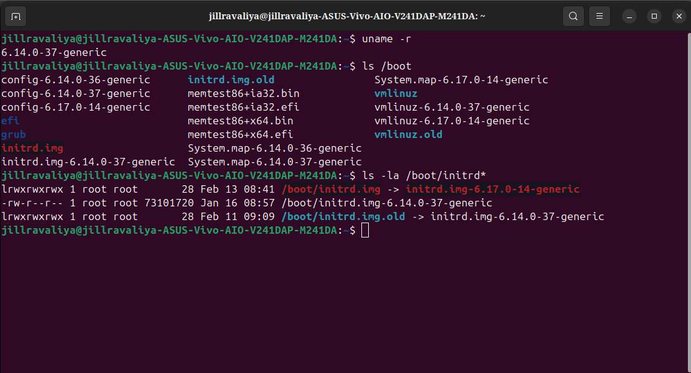

**The smoking gun: the initrd.img symlink points to a file that was never created**

The symlink is a pointer to nothing. It's like having a road sign that says "Bridge ahead, 1 mile" but when you arrive, the bridge was never built.

### Why This Matters

When Linux boots, the kernel needs drivers to access your storage. But those drivers are stored ON the storage itself—a chicken-and-egg problem.

The solution? **initrd** (initial RAM disk). It's a small temporary filesystem that GRUB loads into RAM alongside the kernel, containing just enough drivers to mount the real disk. Think of it as a survival kit:

```
1. GRUB loads vmlinuz (kernel) + initrd into RAM
2. Kernel boots, mounts initrd as temporary root
3. Kernel loads storage driver FROM initrd
4. Now kernel can see the actual disk
5. Kernel mounts real filesystem
6. Boot continues normally
```

Without initrd, the kernel boots blind. It cannot see the storage device.

> **That's exactly what `unknown-block(0,0)` means:** block device 0:0 = "I see nothing." The kernel is telling you it looked everywhere for a disk and found absolutely nothing.

### Quick Fix

Generate the missing file:

```bash
$ sudo update-initramfs -c -k 6.17.0-14-generic
update-initramfs: Generating /boot/initrd.img-6.17.0-14-generic

$ sudo update-grub
Found linux image: /boot/vmlinuz-6.17.0-14-generic
Found initrd image: /boot/initrd.img-6.17.0-14-generic
done

$ sudo reboot
```

System booted into 6.17 successfully. Problem solved.

But the question remained: **how did the initrd go missing in the first place?**

---

## Layer 2: The Three-Day Pattern

When Ubuntu installs a kernel, it automatically generates the initrd. Something went wrong during installation. But when? 

Linux keeps detailed logs of every package operation. The dpkg log—Ubuntu's package manager database—records every installation, update, and removal with exact timestamps and status changes. Let me check when kernel 6.17 was installed and what happened:

```bash
$ sudo cat /var/log/dpkg.log | grep "6.17.0-14" | grep "trigproc\|half-configured"
```

**Output:**

```
2026-02-11 09:09:32  trigproc linux-image-6.17.0-14-generic → status half-configured
2026-02-12 09:36:03  trigproc linux-image-6.17.0-14-generic → status half-configured
2026-02-13 08:41:13  trigproc linux-image-6.17.0-14-generic → status half-configured
```

Three days in a row. Same exact failure point. The package reached `half-configured` and died.

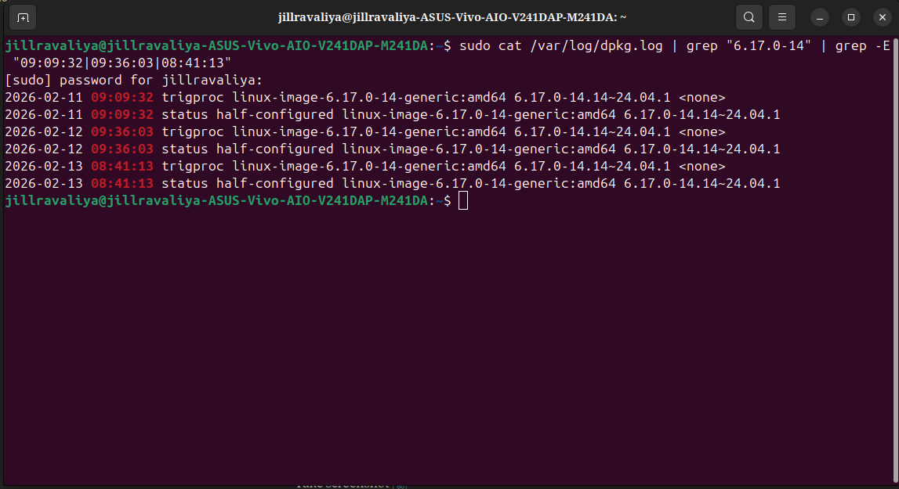

**The dpkg log reveals a consistent pattern: three consecutive days, same failure state**

> **What this means:** Package installation stages go: unpacked (files copied to disk) → half-configured (setup started) → installed (fully ready). The kernel got stuck in the middle, three days straight.

That `trigproc` line stands for "trigger processing"—post-installation tasks that run automatically after the main package files are in place. For a kernel, these triggers handle generating the initramfs (the initrd file we saw missing), updating GRUB's boot menu configuration, compiling any third-party kernel modules via DKMS, and running hardware-specific hooks. They run silently in the background during normal `apt upgrade` operations.

Something in that trigger processing was failing consistently.

---

## Layer 3: The Hidden DKMS Killer

The dpkg log shows status changes—not the actual errors that caused those status changes. It's like seeing "flight cancelled" on an airport board without knowing if it's weather, mechanical issues, or crew problems. For the detailed error messages and command output, I needed to check the apt terminal log, which captures everything that happens during package installations:

```bash
$ sudo cat /var/log/apt/term.log | grep -C 5 "exit status 11"
```

**Output:**

```
Setting up linux-image-6.17.0-14-generic ...
dkms: running auto installation service for kernel 6.17.0-14-generic
...fail!
run-parts: /etc/kernel/postinst.d/dkms exited with return code 11

dpkg: error processing package linux-image-6.17.0-14-generic (--configure):
 subprocess returned error exit status 11
```

**DKMS failed with exit code 11.** When DKMS failed, the entire kernel installation aborted.

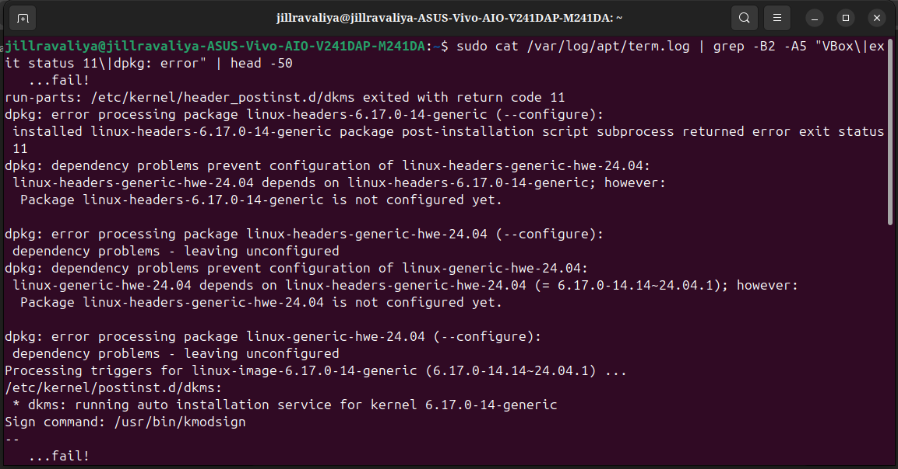

**The apt log shows DKMS returning exit code 11, which stopped the entire installation process**

> **DKMS failed with exit code 11.** When DKMS failed, the entire kernel installation aborted.

In Unix/Linux, programs return exit codes to indicate success or failure. Exit code 0 means success, anything else means failure. Exit code 11 is DKMS's way of saying "I tried to compile a module and it failed catastrophically." When the kernel installation process saw that non-zero exit code, it stopped everything.

DKMS—Dynamic Kernel Module Support—automatically manages third-party kernel modules, pieces of code that aren't part of the official Linux kernel source tree but need to integrate deeply with it. Think of them as add-ons: VirtualBox drivers that let you run virtual machines, NVIDIA proprietary graphics drivers for GPU acceleration, ZFS filesystem drivers for advanced storage features, various VPN or WiFi drivers that hardware vendors provide.

Here's the problem DKMS solves: Kernel modules are compiled code, tightly coupled to the kernel's internal APIs and data structures. A module compiled for kernel 6.14 won't work on kernel 6.17—the internal kernel interfaces changed between versions, so the module needs to be recompiled against the new kernel's headers. Without DKMS, you'd have to manually track down and recompile every third-party module every time you installed a new kernel. DKMS automatically detects kernel upgrades, recompiles all registered modules against the new kernel, and installs them in the right location. You install a driver once, and DKMS handles it forever—no manual intervention needed when kernels update.

But in my case, DKMS tried to compile something and failed. The question was: what was it trying to compile, and why did the compilation fail?

---

## Layer 4: The Broken VirtualBox Package

Let me find the actual compilation error—the specific C compiler message that caused DKMS to fail:

```bash
$ sudo cat /var/log/apt/term.log | grep -B 5 -A 10 "VBox"
```

**Output:**

```
Building module:
make -j2 KERNELRELEASE=6.17.0-14-generic
...(bad exit status: 2)

Error! Bad return status for module build on kernel: 6.17.0-14-generic (x86_64)

vboxdrv/include/SUPDrvInternal.h:47:10: 
  fatal error: VBox/cdefs.h: No such file or directory
   47 | #include <VBox/cdefs.h>
compilation terminated.
```

**VirtualBox.** The very VirtualBox I installed to safely build and test my kernel driver.

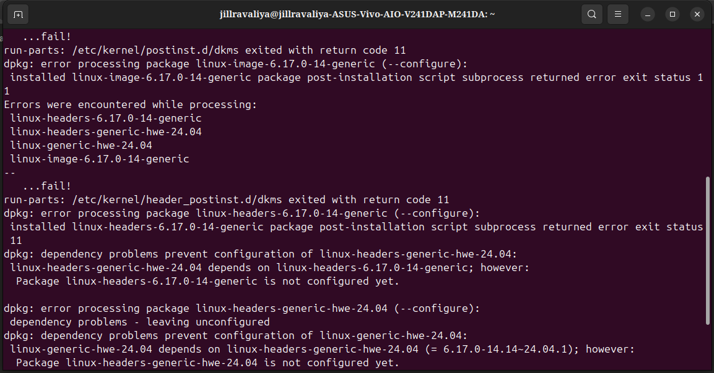

**The compilation log reveals the missing header: VBox/cdefs.h was stripped from Ubuntu's dfsg package**

The C compiler tried to compile VirtualBox's kernel module and hit line 47 of a source file, which says `#include <VBox/cdefs.h>`. In C programming, `#include` pulls in header files—files containing declarations, type definitions, and function prototypes that your code needs to compile. Without the header file, the compiler has no idea what data structures or functions to use, so compilation fails immediately. It's like trying to build IKEA furniture but the instruction manual is missing—you have the pieces but no idea how they fit together.

Let me check which version of VirtualBox is installed:

```bash
$ apt-cache policy virtualbox
virtualbox:
  Installed: 7.0.16-dfsg-2ubuntu1.1
```

Notice **dfsg** in the version string. DFSG stands for "Debian Free Software Guidelines"—the principles that govern what software Debian and Ubuntu will ship in their main repositories. Ubuntu and Debian are committed to shipping only free and open-source software in their default package repositories. VirtualBox, however, is developed by Oracle and contains proprietary components that don't meet these free software criteria.

When Ubuntu packages VirtualBox for their repositories, they strip out those proprietary components to maintain their open-source principles. The result is a "dfsg" version—a modified package with proprietary pieces removed. But here's the problem: one of those removed proprietary components contained essential header files, including `VBox/cdefs.h`.

> Ubuntu shipped a broken package: a DKMS module that registers to compile for every new kernel but cannot actually compile because it's missing its own headers.

This package was a ticking time bomb from installation.

> **The irony:** I installed VirtualBox to create a safe sandbox for kernel experiments. VirtualBox never caused problems inside the VM—the VM ran perfectly, I crashed kernels in it, fixed bugs, learned safely. But VirtualBox's mere presence on the host system—registered with DKMS as a "compile me for every new kernel" module—became a silent threat waiting for the next kernel upgrade.

When kernel 6.17 tried to install → DKMS attempted to compile VirtualBox → compilation failed due to missing headers → DKMS returned exit code 11 → entire kernel installation aborted.

But why did DKMS failing prevent initrd generation? Aren't those separate operations?

---

## Layer 5: The Alphabetical Execution Trap

To understand why DKMS failing blocked initrd generation, I need to show you exactly how kernel post-installation scripts work. When a kernel package installs, it doesn't just copy files and call it done—it needs to run several setup operations to make the kernel actually bootable. These operations are handled by scripts in a specific directory:

```bash
$ ls /etc/kernel/postinst.d/
dkms
initramfs-tools
unattended-upgrades
update-notifier
xx-update-initrd-links
zz-shim
zz-update-grub
```

These scripts are executed by a program called `run-parts`, which is a simple but strict script executor. It has one iron-clad rule: **execute all scripts in alphabetical order, and if any script returns a non-zero exit code (indicating failure), stop immediately and don't run any subsequent scripts.**

This execution model is intentional. The reasoning: later scripts often depend on earlier scripts succeeding. If an early script fails, continuing to run later scripts might leave the system in a partially configured and potentially dangerous state.

Look at the order:
- `dkms` (starts with 'd') - runs FIRST
- `initramfs-tools` (starts with 'i') - runs SECOND

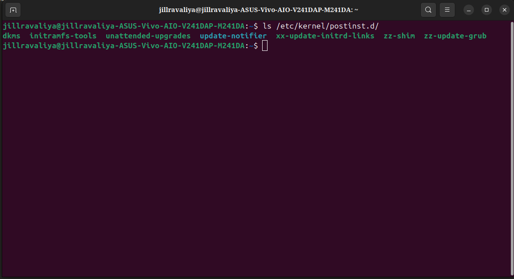

**The alphabetical ordering: dkms executes before initramfs-tools, creating a critical dependency**

When DKMS returned exit code 11 → `run-parts` stopped → everything after `dkms` never executed → including `initramfs-tools`.

> **That's why the initrd was never generated.** One broken VirtualBox header blocked the entire critical boot preparation sequence.

**Why this design?** Later scripts often depend on earlier ones succeeding. For example, `zz-update-grub` needs the initrd file to exist before it can create proper boot menu entries. If `initramfs-tools` failed but `zz-update-grub` ran anyway, you'd get boot entries pointing to non-existent initrd files—exactly the unbootable situation I encountered.

The "stop on first error" design makes sense in theory. But in practice, one unrelated failure (VirtualBox compilation) cascades into a completely separate critical failure (missing initramfs).

---

## Layer 6: Why NVMe Systems Die Without initramfs

I understood the chain now: VirtualBox DKMS failed → scripts stopped → initramfs never generated. But why does missing initramfs cause panic specifically on NVMe?

```bash
$ cat /boot/config-6.17.0-14-generic | grep "NVME\|INITRAMFS"
```

**Output:**

```
CONFIG_BLK_DEV_INITRD=y
CONFIG_INITRAMFS_SOURCE=""
CONFIG_BLK_DEV_NVME=m
```

**What this means:**

**CONFIG_BLK_DEV_INITRD=y**  
Kernel CAN use an initrd if provided—but doesn't have one built in.

**CONFIG_INITRAMFS_SOURCE=""**  
Empty string = NO embedded initramfs. Ubuntu keeps the kernel small, relies entirely on external initrd.

**CONFIG_BLK_DEV_NVME=m**  
The `=m` means NVMe driver is a MODULE, not built into the kernel.

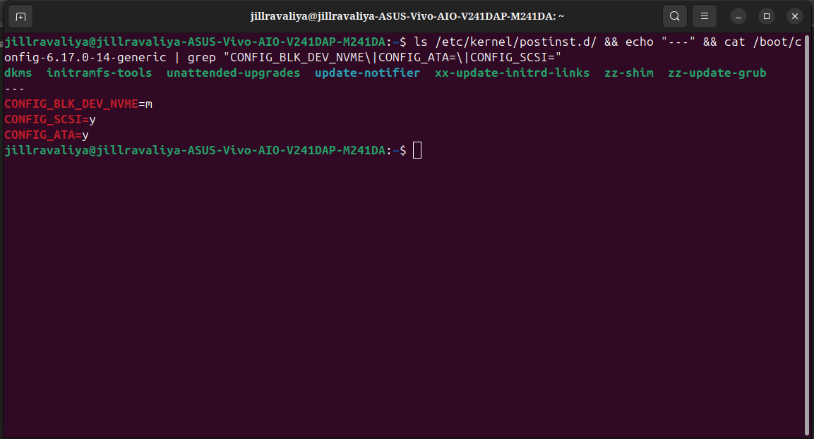

**The kernel config reveals the critical dependency: CONFIG_BLK_DEV_NVME=m means the NVMe driver must be loaded from initramfs**

Compare to SATA: `CONFIG_ATA=y` (built-in). SATA systems can boot without initramfs because the driver is already in the kernel binary. But NVMe? The driver exists only as `nvme-core.ko.zst`—a compressed module inside the initramfs.

**Without initramfs:** Module never loads → kernel cannot see NVMe SSD → `unknown-block(0,0)`.

**Why design it this way?** Smaller kernel binary (faster boot), modularity (update drivers without recompiling kernel), flexibility (not every system has NVMe). But this design has one critical requirement: **initramfs must exist.**

### Proof

```bash
$ lsinitramfs /boot/initrd.img-6.17.0-14-generic | grep -i "nvme"
usr/lib/modules/6.17.0-14-generic/kernel/drivers/nvme/host/nvme-core.ko.zst
usr/lib/modules/6.17.0-14-generic/kernel/drivers/nvme/host/nvme.ko.zst
```

Without initramfs, the NVMe driver modules are completely inaccessible:


**Listing the contents of initramfs shows nvme-core.ko.zst exists only inside this temporary filesystem**

And from the working kernel's boot log:

```bash
$ journalctl -b -1 | grep -i "initramfs\|nvme" | head -5
kernel: Trying to unpack rootfs image as initramfs...
kernel: nvme nvme0: pci function 0000:02:00.0
kernel: nvme nvme0: 8/0/0 default/read/poll queues
kernel: EXT4-fs (nvme0n1p1): mounted filesystem
```

Boot sequence: unpack initramfs → load NVMe driver → device appears → filesystem mounts.

Remove step 1? Steps 2-4 never happen.

---

## Layer 7: Boot Log Evidence

The working kernel's complete boot sequence confirms the dependency:

```
Power On → BIOS → GRUB
    ↓
GRUB loads vmlinuz + initrd into RAM
    ↓
Kernel boots, mounts initrd as temporary root
    ↓
Kernel loads NVMe driver FROM initrd
    ↓
NVMe SSD becomes visible
    ↓
Kernel mounts real filesystem
    ↓
systemd starts
```

If initrd is missing at step 4: instant collapse on NVMe systems.

**Why design it this way?** Smaller kernel binary, flexibility to update drivers without recompiling the kernel, modularity. But it has one critical requirement: **initramfs must exist.**

---

## Layer 8: The systemd Silent Failure Bug

I had the complete chain:
1. VirtualBox DKMS fails
2. Scripts stop
3. initramfs never generated
4. Kernel boots blind
5. Panic

But one question bothered me: **why did GRUB create a boot entry for kernel 6.17 when initrd was missing? Why no warning?**

If initrd is so critical, shouldn't the installation refuse to complete without it?

I found another script directory:

```bash
$ ls /usr/lib/kernel/install.d/
50-depmod.install
55-initrd.install
90-loaderentry.install
90-update-grub.install
```

Let me check `55-initrd.install`:

```bash
$ cat /usr/lib/kernel/install.d/55-initrd.install
```

**Critical section:**

```bash
INITRD_SRC="/boot/initrd.img-$KERNEL_VERSION"

if [ -e "$INITRD_SRC" ]; then
    install -m 0644 "$INITRD_SRC" "$INITRD_DEST"
else
    echo "$INITRD_SRC does not exist, not installing an initrd"
fi

exit 0
```

**Look at that last line.**

The script checks if initrd exists. If it does, great—installs it to the boot partition. But if the initrd is missing, the script prints a quiet message (only if verbose mode is enabled, which it typically isn't during normal apt operations) and then...

**Returns exit 0 (SUCCESS).**

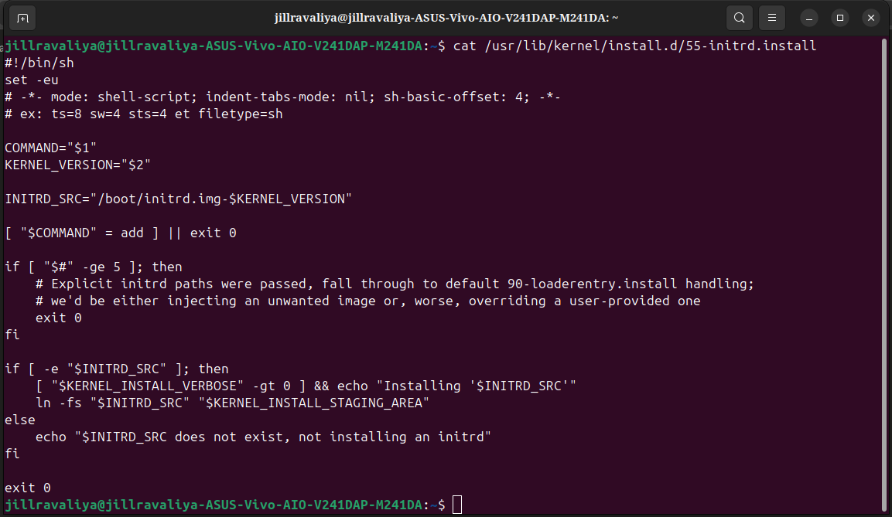

**The source code reveals the bug: script exits with 0 (success) even when initrd is missing**

The script tells the system "everything worked perfectly!" even though a critical boot file is completely missing. GRUB receives this "all good!" signal and confidently creates an unbootable boot entry.

**This is the bug.** The script should return `exit 1` (FAILURE) when initrd is missing. That would:
- Stop the kernel installation
- Cause dpkg to report a visible error
- Prevent GRUB from creating unbootable entries
- Alert the user BEFORE rebooting

Instead, by returning exit 0, the error gets swallowed. Invisible until you reboot and panic.

**Who owns this file?**

```bash
$ dpkg -S /usr/lib/kernel/install.d/55-initrd.install
systemd: /usr/lib/kernel/install.d/55-initrd.install
```

Part of **systemd** package (version 255.4-1ubuntu8.12). A bug in systemd's kernel-install infrastructure, carried by both Debian and Ubuntu.

> **The fix?** Four characters: change `exit 0` to `exit 1` when initrd is missing.

---

## Root Cause vs Trigger: A Critical Distinction

Now I could answer: "What caused the kernel panic?"

But there's a crucial distinction:

> **VirtualBox is NOT the root cause.**  
> **VirtualBox is the TRIGGER that exposed a deeper bug.**

Let me explain this distinction, because it's the difference between surface-level troubleshooting and genuine systems thinking.

### The Trigger

- VirtualBox's DKMS module failed because Ubuntu ships a broken dfsg package
- That failure blocked initramfs generation
- Immediate proximate cause that set events in motion

### The Root Cause

- systemd's `55-initrd.install` returns exit 0 (success) when initrd is missing
- Allows GRUB to create unbootable entries with zero warning
- Underlying design flaw that allowed a critical failure to occur silently

### Why This Matters

If I say "VirtualBox caused my kernel panic," that's surface-level thinking. True—removing VirtualBox fixed it. But it misses the deeper issue.

**The truth:** ANY DKMS module failure would trigger this panic on NVMe systems:
- nvidia-dkms compilation failure → same panic
- zfs-dkms compilation failure → same panic  
- Any third-party driver compilation failure → same panic

Any failure would block initramfs generation, and systemd's silent exit 0 would allow unbootable boot entries.

> **The real fault is the design bug that allows silent failure when a critical component is missing.** The system should fail loudly and visibly when something this critical goes wrong.

**For technical discussions:**

**Surface-level answer:**
- "VirtualBox caused my panic, so I removed it"
- Fixes the immediate problem
- Misses the deeper architectural issue

**Systems thinking answer:**
- "The root cause is systemd's 55-initrd.install returning exit 0 when initrd is missing"
- "This allows GRUB to create unbootable boot entries with zero user warning"
- "VirtualBox DKMS failure was the trigger, but any DKMS failure would expose this bug on NVMe systems"
- "The fix isn't just removing VirtualBox—it's patching systemd to fail loudly when critical boot files are missing"

---

## Filing the Bug Report

I searched Ubuntu's Launchpad bug tracker. The VirtualBox DKMS failure was already known:

**Bug #2136499** - virtualbox-dkms fails to build
- 110+ affected users
- 618 comments
- Status: Confirmed

But as I read through those 618 comments—nobody had traced the problem to systemd's silent failure.

So I filed a new bug against systemd:

**Bug #2141741:** *55-initrd.install silently exits 0 when initrd missing causing undetectable kernel panic on NVMe systems*

**My report included:**

1. What happens: systemd's script detects missing initrd but returns exit 0 (success)
2. Why critical: Allows unbootable boot entries with zero warning
3. Affected systems: Any NVMe system where any DKMS module fails
4. Proposed fix: Change line 26 from `exit 0` to `exit 1`

I attached full error logs, the complete failure chain I had traced, and proof from my system showing the exact sequence of events.

I hit submit. The bug appeared on Launchpad with a fresh ID: **Bug #2141741**.

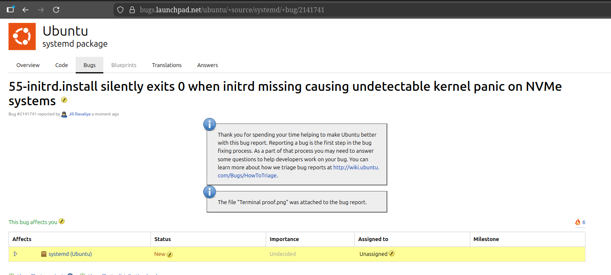

**Bug #2141741 filed on February 13, 2026 with initial status "New"—the investigation begins**

Then I posted Comment #9 on the VirtualBox bug, linking to my systemd report. This connected the 110+ affected users to the deeper root cause finding. I explained how their VirtualBox DKMS failures were just the trigger—the real problem was systemd's silent exit 0 allowing unbootable boot entries.

I didn't expect a fast response. Ubuntu developers are busy. Bug trackers move slowly.

But two hours later, I refreshed the page. The status had changed.

**Result:** Within 2 hours, Ubuntu developers reviewed my analysis and confirmed the bug. Status: "Confirmed" ✅

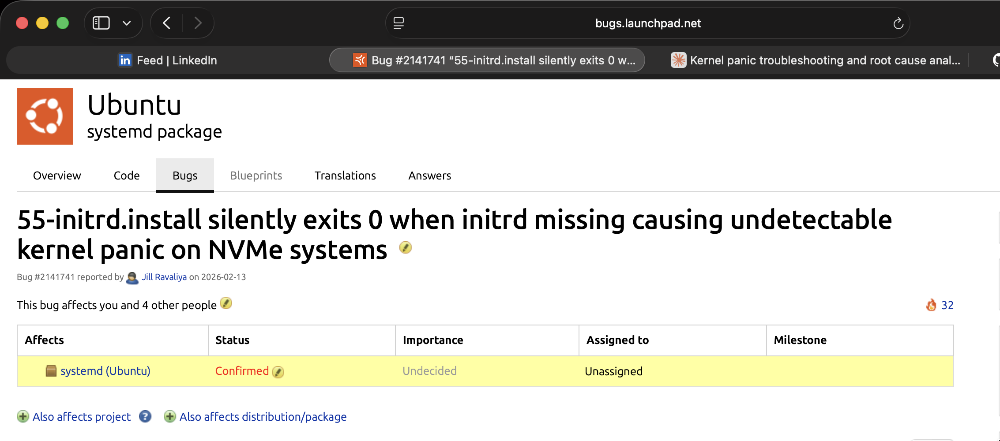

**Less than 24 hours later: Bug confirmed by Ubuntu developers, now affecting 5 users—validating the root cause analysis**

The confirmation meant Ubuntu's developers agreed: this wasn't just a VirtualBox problem. It was a systemd infrastructure bug that could affect anyone with DKMS module failures on NVMe systems.

---

## System Restored

The immediate fix:

```bash
# Remove VirtualBox
$ sudo apt remove --purge virtualbox
$ sudo dkms remove virtualbox/7.0.16 --all

# Verify clean
$ dkms status
[empty]

# Both kernels now have initrd
$ ls -la /boot/initrd*
-rw-r--r--  73101720  initrd.img-6.14.0-37-generic
-rw-r--r--  73711966  initrd.img-6.17.0-14-generic

# Running latest kernel
$ uname -r
6.17.0-14-generic
```

System healthy. Both kernels bootable.

---

## The Complete Failure Chain

```
Ubuntu ships virtualbox-7.0.16-dfsg (missing VBox/cdefs.h)
    ↓
Feb 11, 09:09 AM - apt upgrade installs kernel 6.17
    ↓
DKMS attempts VirtualBox compilation → fails (missing header)
    ↓
DKMS returns exit code 11
    ↓
run-parts executes postinst.d/ alphabetically
    ↓
'dkms' runs before 'initramfs-tools' → sees error → STOPS
    ↓
initramfs-tools NEVER runs
    ↓
initrd.img-6.17.0-14-generic NEVER created
    ↓
55-initrd.install detects missing initrd
    ↓
Prints quiet warning → Returns exit 0 (SUCCESS) ← THE BUG
    ↓
GRUB receives "all good" → Creates boot entry for 6.17
    ↓
Feb 13, Morning - I reboot
    ↓
GRUB loads kernel 6.17 → tries to load initrd → doesn't exist
    ↓
Kernel boots WITHOUT initrd
    ↓
NVMe driver (CONFIG_BLK_DEV_NVME=m) only exists in initramfs
    ↓
Module never loads → Kernel cannot see NVMe SSD
    ↓
unknown-block(0,0)
    ↓
KERNEL PANIC 💀
```

---

## What I Learned

### Silent Failures Are Deadly

When `55-initrd.install` returned exit 0 despite missing initrd:

**What happened:**
```
initrd missing → quiet warning → exit 0 → 
GRUB creates entry → user reboots → PANIC
```

**What should happen:**
```
initrd missing → exit 1 → dpkg fails → 
apt shows error → user fixes BEFORE reboot
```

> **Silent success broke error propagation.** Failure became invisible until catastrophic.

### Investigation Depth Matters

Most people stop at layer 2 or 3. I went to layer 8:

1. Missing initrd file
2. Three-day installation failure
3. DKMS exit 11
4. VirtualBox compilation error
5. Alphabetical script ordering
6. NVMe module design
7. Boot log evidence
8. systemd silent exit 0 ← **The actual bug**

Each layer revealed why the previous failed.

---

## Connect With Me

I'm actively learning and building in the **systems programming** and **kernel development** space.

- **Email:** jillahir9999@gmail.com
- **LinkedIn:** [linkedin.com/in/jill-ravaliya-684a98264](https://linkedin.com/in/jill-ravaliya-684a98264)
- **GitHub:** [github.com/jillravaliya](https://github.com/jillravaliya)

**Open to:**

- Kernel development mentorship
- Systems programming collaboration
- Technical discussions on kernel internals
- Open source contribution guidance

---

### ⭐ Star this repository if you find it helpful for your kernel development journey!

---

> **For detailed explanations, navigate to individual topic folders. Each contains a comprehensive README covering its area.**

<div align="center">


</div>

